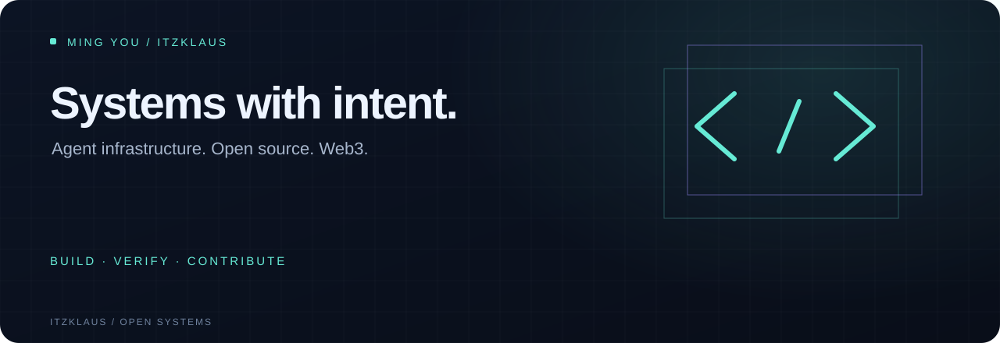

  <a href="https://github.com/itzKLAUS?tab=repositories">Projects</a> ·
  <a href="https://github.com/pulls?q=is%3Apr+author%3AitzKLAUS">Contributions</a> ·
  <a href="https://github.com/itzKLAUS?tab=achievements">Achievements</a> ·
  <a href="https://github.com/sponsors/itzKLAUS">Support the work</a>

## Building systems that earn trust

I'm **Ming You**, also known as **Klaus**. I build tools for reliable automation and contribute fixes to open-source projects. My current contribution focus is **Web3**: useful patches, reproducible bugs and careful verification.

The questions behind my infrastructure work are simple: **Who authorized this action? What happens when a worker crashes? How do we account for the result?**

## Three tools. Three responsibilities.

| Project | The problem it tackles | Built for |
| :-- | :-- | :-- |
| [**Agent Outbox**](https://github.com/itzKLAUS/agent-outbox) | A business write survives, but its intended external action gets lost—or the result becomes uncertain. | Python applications and dispatch workers |
| [**Delegation Gate**](https://github.com/itzKLAUS/delegation-gate) | A worker needs a smaller grant of authority without a root credential or an independent copy of the quota. | Trusted tool gateways and agent runtimes |
| [**Action Ledger**](https://github.com/itzKLAUS/action-ledger) | Consequential automation needs policy checks, budget reservations, independent review and a traceable result. | Teams operating automation |

These projects have distinct integration boundaries. Read each project's verification and deployment notes before using it for consequential work.

## Open-source work

Selected contributions to upstream projects—these are contributions, not affiliations:

- **MetaMask:** [ABI array encoding](https://github.com/MetaMask/abi-utils/pull/99), [unsigned integer validation](https://github.com/MetaMask/abi-utils/pull/100) and [signature utility typing](https://github.com/MetaMask/eth-sig-util/pull/429).
- **Ethereum:** [utility type inference](https://github.com/ethereum/eth-utils/pull/336) and [signature preservation](https://github.com/ethereum/eth-utils/pull/337).
- **Microsoft Scope:** [full-bleed preview layout](https://github.com/microsoft/scope/pull/1459) and [nested preview coverage](https://github.com/microsoft/scope/pull/1464).

Each link shows the current review and merge status. GitHub achievements include **Pull Shark** and **Quickdraw**; [view the profile badges](https://github.com/itzKLAUS?tab=achievements).

## How I approach the work

**Reproduce the failure → make a focused change → verify the behavior → document the limits.**

Python · TypeScript · SQL · Django · GitHub Actions · Ethereum tooling

Good issue reports, integration feedback and code reviews help these projects improve. Sponsorship supports maintenance, regression testing and documentation; it does not purchase security guarantees or roadmap commitments.

<a href="https://github.com/sponsors/itzKLAUS">♥ Sponsor open-source maintenance</a> · <a href="https://x.com/itzklaus2">Find me on X</a>

